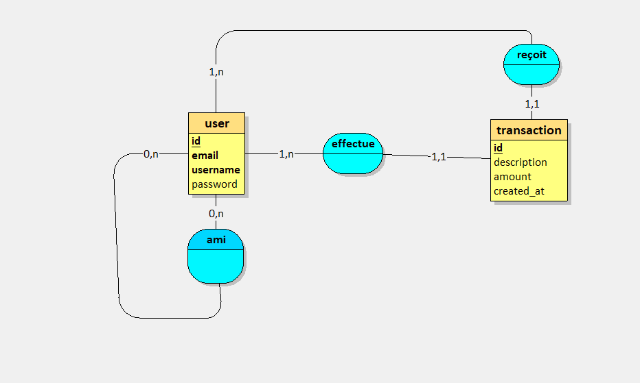

# PayMyBuddy_VanninSasha

Application de paiement bancaire simplifiée permettant aux utilisateurs d'effectuer des transactions sécurisées et se connecter entre utilisateurs.

---

## Description

PayMyBuddy est une application permettant aux utilisateirs : 

-de créer un compte 
-d'ajouter des contacts
-d'envoyer de l'argent à leurs contacts
-de consulter l'historique des transactions

L'objectif est de mettre en place une application facilitant les transactions entre amis et proches.

## Modèle physique de données (MPD)

Le modèle physique de données décrit la structure de la base de données et les relations entre les différentes tables.

## Diagramme MPD

## Base de données

Le script de création et de sauvegarde de la base de données se trouve dans :

database/backup_paymybuddy.sql

## Auteur

Sasha Vannin
