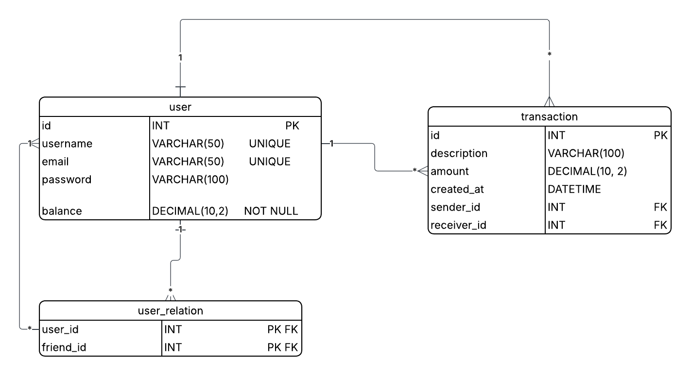

# PayMyBuddy_VanninSasha

Application de paiement bancaire simplifiée permettant aux utilisateurs d'effectuer des transactions sécurisées et se connecter entre utilisateurs.

---

## Description

PayMyBuddy est une application permettant aux utilisateurs : 

-de créer un compte 
-d'ajouter des contacts
-d'envoyer de l'argent à leurs contacts
-de consulter l'historique des transactions

L'objectif est de mettre en place une application facilitant les transactions entre amis et proches.

## Modèle physique de données (MPD)

Le modèle physique de données décrit la structure de la base de données et les relations entre les différentes tables.

## Diagramme MPD



## Base de données

Le script de création et de sauvegarde de la base de données se trouve dans :

database/backup_paymybuddy.sql

## Installation de la base de données
1. Exécution du script SQL
database/backup_paymybuddy.sql

2. Création d'un utilisateur MySQL

3. Création d'utilisateurs de tests dans la base de données

## Configuration
Fichier src/main/resources/application.properties :
```properties
spring.datasource.url=jdbc:mysql://localhost:3306/PayMyBuddy
spring.datasource.username=root
spring.datasource.password=<votre_mot_de_passe>
````

## Lancement
```lancement
mvn spring-boot:run
````

## Tests
```Test
mvn test
```

## Auteur

Sasha Vannin
